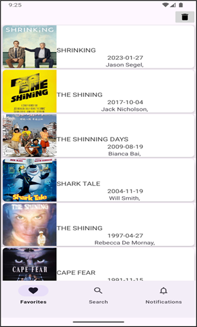
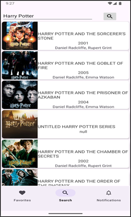
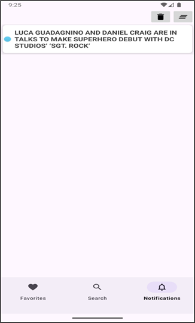
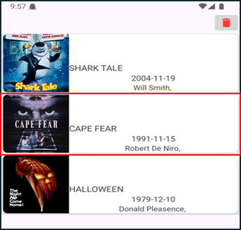
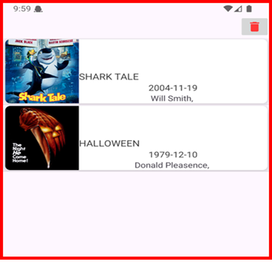
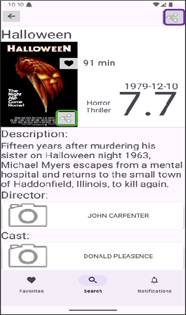
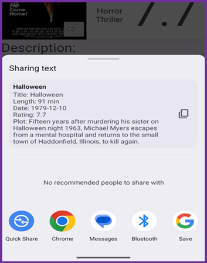
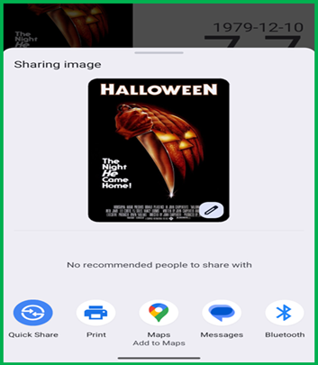
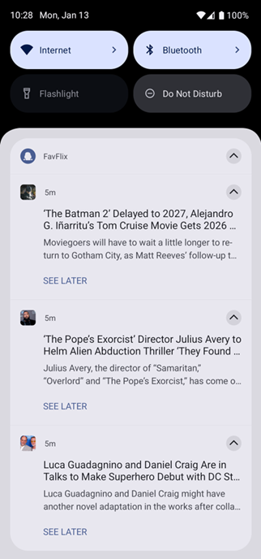
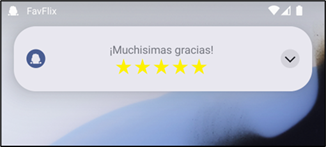

# 🎬 Movies App - FAVFLIX
Aplicación Android desarrollada en Java para explorar películas, gestionar favoritos y compartir contenido.

## 📌 Características principales
### 🎨 Diseño e Interfaz
- Diseño de iconos: Personalizados para una experiencia visual coherente.  
     
- Uso de Fragments: Arquitectura modular para una navegación fluida.
- Elementos de lista: Adaptadores personalizados para mostrar películas.     

  
  
  
 

### 🌐 Gestión de Datos
- Descarga desde servidor remoto (Utilizando la API pública [IMDbOT](https://github.com/TelegramPlayground/Free-Movie-Series-DB-API) ): 
  - Primera descarga: Búsqueda inicial de películas.
  - Segunda descarga: Detalles al hacer click en una película.
- Modo Offline:
  - Las películas favoritas se guardan localmente (SQLite/Room).
  - Eliminación permanente en "modo eliminar".    

  
  

### 🤝 Compartir Datos
Integración con FileProvider para compartir imágenes/películas vía apps externas (WhatsApp, correo, etc.).   

  
   
  
  

### 🔔 Notificaciones
- Prioridad baja:
  - Programadas con JobService cuando la app está en pausa.
  - Acciones manejadas por un BroadcastReceiver.
 

   
 

 
- Prioridad alta:
  - Implementadas con WorkManager en 2 fases:
  - Creación y mantenimiento en espera.
  - Actualización dinámica.

  
  

    
### 🛠️ Tecnologías y Componentes
- Lenguaje: Java (Android SDK).
- Arquitectura: MVC
- Almacenamiento: SQLite (offline).
- Concurrencia: WorkManager, JobScheduler.
- Seguridad: FileProvider para acceso a archivos.

